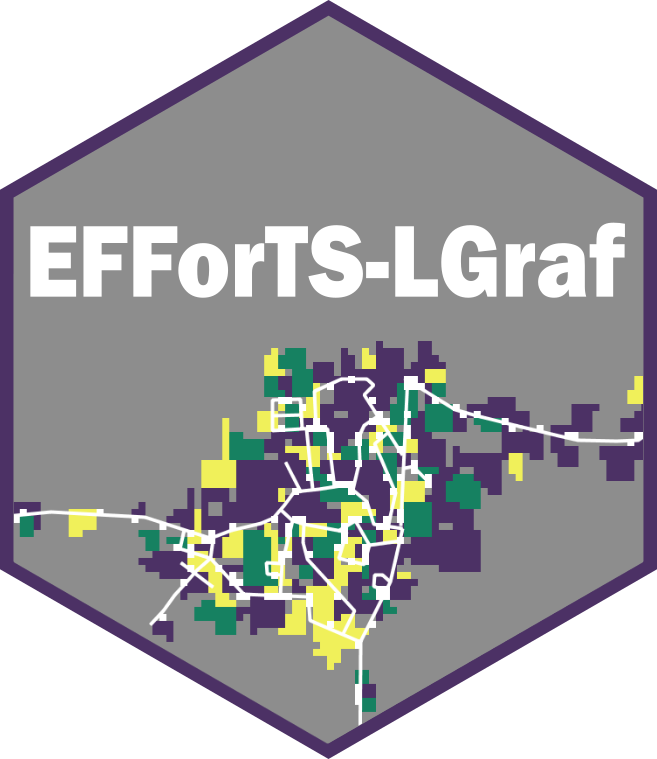

# EFForTS-LGraf 

EFForTS-LGraf: A Landscape Generator for Creating Smallholder-Driven Land-Use Mosaics

## Publication

This repository contains accompanying model files, data and analysis scripts for the following paper:

Salecker et al. (in revision). EFForTS-LGraf: A Landscape Generator for Creating Smallholder-Driven Land-Use Mosaics.

This repository can be referenced via zenodo:

EFForTS-LGraf and further contents of this repository are published under the GNU General Public License v3.0. Detailed license information can be found in the LICENSE file.

## Content of repository

The contents of this repository are structured as follows:

* 1_Helper
  * EFForTS-LGraf: This folder contains the EFForTS-LGraf model with all needed files to run EFForTS-LGraf standalone on any machine where NetLogo 6 is installed.
  * Contains a portable version of NetLogo 6 to run model analyses scripts directly within this repository.
* 2_Rscripts
  * R scripts that were used to run model analyses that are described in the accompanying publication. The repository includes all needed files to rerun these analysis except for the raw land use map, that was used for validation. A processed summary table with landscape metrics of samples from this land use map is included instead.
* 3_Data
  * Output data from model analyses (Sensitivity analysis, validation, applied case study)
* 4_Plots
  * Figures that are described in the accompanying publication.

## Prerequisites

In order to run EFForTS-LGraf, [NetLogo 6](http://ccl.northwestern.edu/netlogo/download.shtml) needs to be installed. We provide a portable version of NetLogo 6 within the repository. Because NetLogo is executed in a Java virtual machine, Java needs to be installed on the system as well. We recommend the [Oracle Java SE Development Kit 8](https://www.oracle.com/technetwork/java/javase/downloads/jdk8-downloads-2133151.html). 
R and the R package [nlrx, version 0.2.0](https://github.com/ropensci/nlrx) are needed in order to reproduce model analyses. While the nlrx package might work without setting the Java system path explicitly, we recommend to make sure that JAVA_HOME points to the correct Java installation of the system.

## How to reproduce model analyses

This repository contains R scripts to reproduce model analyses from the accompanying paper.
However, due to copyright reasons we do not provide the land-use map raster, that has been used vor validation.
We only include the calculated landscape metrics of the samples from this map that were used for validation purposes. Because we were interested in underlying mechanics and validity we had to simulate thousands of maps.
These simulations might take a long time, depending on your machine. Thus, we provide .rds files with simulation results for all aproaches. 

For all three aproaches, you can skip 'Step 2: Use nlrx to run simulations' and continue with restoring the simulations results from file in 'step 3' and only execute the postprocessing code sections.

## How to use EFForTS-LGraf

We have created a detailed manual for EFForTS-LGraf which is hosted at [github](https://github.com/nldoc/EFForTS-LGraf.bookdown) and can be viewed via [https://nldoc.github.io/EFForTS-LGraf.bookdown/](https://nldoc.github.io/EFForTS-LGraf.bookdown/).

The manual contains detailed descriptions of model installation, parameters and functions.
It contains several use cases and application examples. There are also some examples which guide you trough automated map creation via the [nlrx package](https://github.com/ropensci/nlrx).

