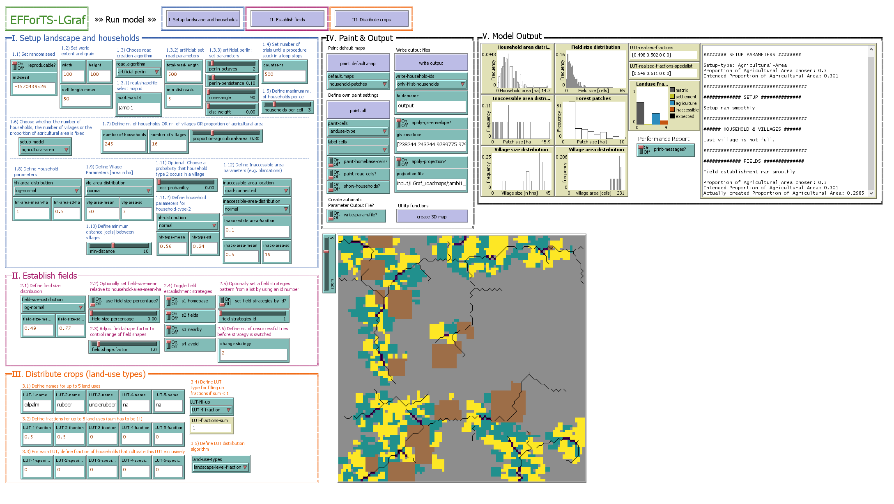

# EFForTS-LGraf
EFForTS-LGraf: A Landscape Generator for Creating Smallholder-Driven Land-Use Mosaics

## Publication

This repository contains accompanying model files, data and analysis scripts for the following paper:

Salecker et al. (in revision). EFForTS-LGraf: A Landscape Generator for Creating Smallholder-Driven Land-Use Mosaics.

## Content of repository

The contents of this repository are structured as follows:

* 1_Helper
  * EFForTS-LGraf: This folder contains the EFForTS-LGraf model with all needed files to run EFForTS-LGraf standalone on any machine where NetLogo 6 is installed.
  * Contains a portable version of NetLogo 6 to run model analyses scripts directly within this repository.
* 2_Rscripts
  * R scripts that were used to run model analyses that are described in the accompanying publication. The repository includes all needed files to rerun these analysis except for the raw land use map, that was used for validation. A processed summary table with landscape metrics of samples from this land use map is included instead.
* 3_Data
  * Output data from model analyses (Sensitivity analysis, validation, applied case study)
* 4_Plots
  * Figures that are described in the accompanying publication.
  

## How to use EFForTS-LGraf as a standalone tool

EFForTS-LGraf is structured in three submodels. First, the landscape and households are created. Second, fields are established by the households. Third, crop types are distributed to these fields. Finally, maps can be stored as ascii files. All parameters on the graphical user interface are numbered and guide you trough parameterization of the model.

#### 1. Setup landscape and households

* 1.1) First define if a randomly drawn seed will be used or set a specific seed to make map generation reproducible
* 1.2) Set the dimesnions of the landscape in cells, and the corresponding cell resolution in meter (used for area calculations)
* 1.3) Choose algorithm for road creation
* 1.3.1) If real-road-map has been chosen in 1.3), select the road map ID
* 1.3.2) If an artificial road generation algorithm has been chosen in 1.3), define the number of raod cells and the minimum distance between roads
* 1.3.3) If artifical.perlin has been chosen in 1.3) define the parameters for the perlin noise algorithm
* 1.4) Set the maximum number of trials for loops. Depending on the parameterization, a low value may result in landscapes that do not represent the specified needs accurately. Larger numbers may increase simulation time.
* 1.5) Define the number of households that are allowed to have a homebase on the same cell
* 1.6) Choose a setup type:
  * number-of-households: Define a total number of households in 1.7)
  * number-of-villages: Define a total number of villages in 1.7)
  * proportion-agriculture: Define the final proportion of fields in the landscape in 1.7)
* 1.8) Define household parameters. Here you can define the area distribution of households in the landscape. You can define the type of distribution from which household areas are drawn during initialization. You can also define the parameters of these distributions.
* 1.9) Define village parameters. Here you can define the area distribution of villages (accumulation of households) in the landscape. You can define the type of distribution from which village areas are drawn during initialization. You can also define the parameters of these distributions.
* 1.10) Define the minimum distance between villages in cells. For certain parameterizations, this distance might not be realized. In such cases, a wrning will appear that distances between villages are lower than specified.
* 1.11) This experimental feature allows to create a second type of household in the model, that uses a diferent area distribution (as defined in 1.11.2).
* 1.12) Define inaccessible areas that are created during setup. These areas are not available for field creation by smallholder households. These areas may represent conservation areas or company plantations that are not owend by smallholders.

Once all these parameters are porperly defined, press the button "I. Setup landscape and households" to execute model initialization.
This procedure will setup the initial landscape with roads, villages, households and inaccessible areas as specified.

#### 2. Establish fields

During model initialization, households have been created with a specific household area, drawn from the household area distribution.
During the field establishment procedure, households will realize this household area by establishing fields. Each time a household establishes a field, a field size will be drawn from the defined distribution. More details on field establishment can be found in the accompanying publication.

* 2.1) Define the field size distribution for the field establishment procedure.
* 2.2) Instead of defining a soecific mean value for the field size distribution, you can use the field-size-percentage slider to calculate the mean depending on the mean value of the household area distribution.
* 2.3) The field shape factor allows you to define if fields should be mostly quadratic (value = 1) or narrow (values &gt; 1 and values &lt; 1)
* 2.4) Select a set of field establishment strategies. Four strategies are currently implemented. Pred-defined combinations of these strategies can also be selected using parameters of 2.5). A household will try to establish a field under the current strategy for a specified number of tries (as defined in 2.6). If a household does not succeed with the current strategy, it will switch to the next strategy in numeric order (e.g. if all strategies are available and the current strategy is s1.homebase, it will switch to s2.fields).
  * s1.homebase - Households will search for empty cells around their homebase to establish fields
  * s2.fields - Households will search for empty cells around already established fields to establish new fields
  * s3.nearby - Households will search for empty cells in an gradually increasing radius around their homebase
  * s4.avoid - Households will search for empty cells around their homebase, that are only surrounded by empty cells

Once all these parameters are porperly defined, press the button "II. Establish fields" to execute field establishment.

#### 3. Distribute crops

* 3.1) Optionally, define names for up to five different crop types
* 3.2) Define fractions of each cropt type. The sum of these fractions must add up to one
* 3.3) Optionally, for each crop type define the fraction of households that only culativates this crop type. For example, if specialization of crop type 1 is set to 1, each household which cultivates crop type 1, will only cultviate this land-use type (these fractions are only used, if 3.5) land-use-types is set to "household-level-specialization")
* 3.4) Here you can define one of the 5 land-use types which is used to fill up remaining fractions if the defined fractions do not sum up to one.

Once all these parameters are properly defined, press the button "III. Distribute crops" to distribute crops to all fields in the landscape.

#### Output

EFForTS-LGraf provides several ways to investigate model output:

* Performance
  * In box "V. Model output", the switch "print-messages?" can be activated to print a model performance report after each procedure execution. This report will tell you detailed information on current procedures. For example, the report will warn you if some of the specified landscape parameters could not be realized. 
  * In box "IV. Paint & Output", the switch "write-param-file?" can be activated to automatically store a parameter file of the current run in the main folder of the model directory. This can be useful for debugging purposes.
* Paint
  * In box "IV. Paint & Output", two main paining functions are available to display generated maps:
  * "paint.default.map"" will apply a predefined color scheme on the current map. The scheme can be selected from the drop-down menu below the button.
  * "paint.all"" lets you define a custom color scheme. You can choose from several cell variables, add labels and turn on/off certain spatial features.
  * "create-3D-map" is an experimental feature that allows to spawn NetLogo agents in different shapes and colors (trees, houses) to create a 3-dimensional version of the landscape. Currently, this function displays palms and trees to represent typical crops of our case study region in Jambi, Indonesia. However, with little code adjustments, other crop types can be displayed in a similar fashion.
* Plot
  * In box "V. Model output" several plots give you some information about expected and realized size distributions of households, villages, fields and inaccessible areas. You can also check if the defined crop proportions could be realized within the generated landscape.
* Export
  * In box "V. Model output" you can store the current landscape as ascii files by pressing the button "write output". In order to define a location for output files, you need to enter an existing directory in the "foldername" input field.
  * Generated roads can also be exported as polyline shapefile ("write-road-shapefile")
  

#### Use own road shapefiles as road templates

Instead of generating roads, EFForTS-LGraf is able to use an existing roadmap shapefile as input by selecting "real.shapefile" from the dropdown menu under 1.3). These shapefiles are loaded from the folder "LGraf_roadmaps" within the input folder of the model directory.
Own shapefiles can be added here. Please note, own shapefiles need to follow a specified filename format as shown below. At least three files need to be available to load a roadmap shapefile:
* &lt;roadmapid&gt;_road.prj - the projection file of the roadmap
* &lt;roadmapid&gt;_road.shp - the actual shapefile containing road polylines
* &lt;roadmapid&gt;_area.shp - a shapefile with a framing box of the road shapefile which is used to set the dimensions of the landscape

You can replace &lt;roadmapid&gt; with any string, which can then be entered in the input field "road-map-id" under 1.3.1) to load the shapefile. For example, a valid fileset could be named mymap1_road.prj, mymap1_road.shp, mymap1_area.shp. This fileset can then be loaded by selecting "real.shapefile" under 1.3) and entering mymap1 into the input field under 1.3.1).

Five roadmap shapefiles from Jambi, Indonesia are already included in EFForTS-LGraf. These shapefiles can be loaded by entering jambi1, jambi2, jambi3, jambi4 or jambi5 under 1.3.1).

## How to reproduce model analyses

## Further use cases:

#### Example 1:
  