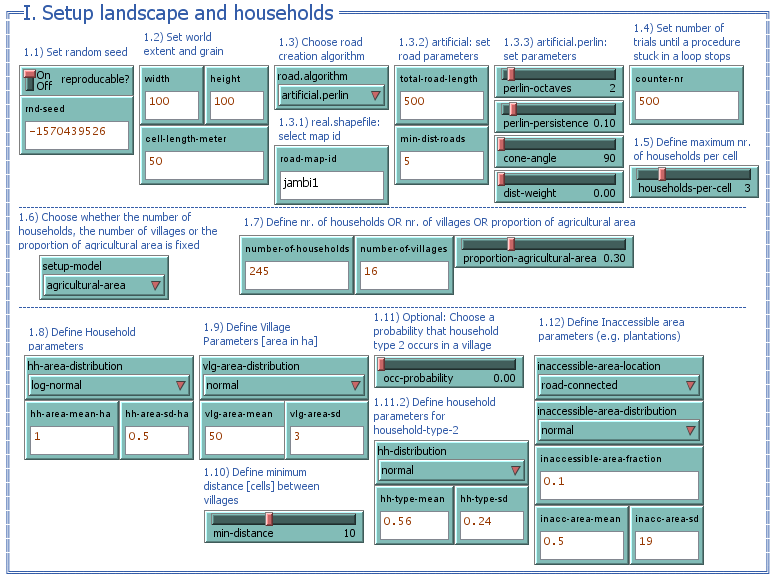
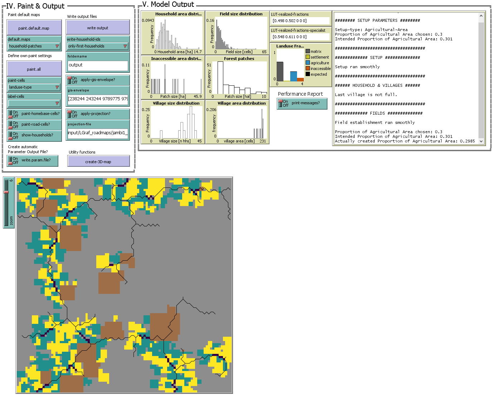

# EFForTS-LGraf
EFForTS-LGraf: A Landscape Generator for Creating Smallholder-Driven Land-Use Mosaics


## Publication

This repository contains accompanying model files, data and analysis scripts for the following paper:

Salecker et al. (in revision). EFForTS-LGraf: A Landscape Generator for Creating Smallholder-Driven Land-Use Mosaics.

This repository can be referenced via zenodo:

[](https://zenodo.org/badge/latestdoi/183651584)

EFForTS-LGraf and further contents of this repository are published under the GNU General Public License v3.0. Detailed license information can be found in the LICENSE file.

## Content of repository

The contents of this repository are structured as follows:

* 1_Helper
  * EFForTS-LGraf: This folder contains the EFForTS-LGraf model with all needed files to run EFForTS-LGraf standalone on any machine where NetLogo 6 is installed.
  * Contains a portable version of NetLogo 6 to run model analyses scripts directly within this repository.
* 2_Rscripts
  * R scripts that were used to run model analyses that are described in the accompanying publication. The repository includes all needed files to rerun these analysis except for the raw land use map, that was used for validation. A processed summary table with landscape metrics of samples from this land use map is included instead.
* 3_Data
  * Output data from model analyses (Sensitivity analysis, validation, applied case study)
* 4_Plots
  * Figures that are described in the accompanying publication.

## Prerequisites

In order to run EFForTS-LGraf, [NetLogo 6](http://ccl.northwestern.edu/netlogo/download.shtml) needs to be installed. We provide a portable version of NetLogo 6 within the repository. Because NetLogo is executed in a Java virtual machine, Java needs to be installed on the system as well. We recommend the [Oracle Java SE Development Kit 8](https://www.oracle.com/technetwork/java/javase/downloads/jdk8-downloads-2133151.html). 
R and the R package [nlrx, version 0.2.0](https://github.com/ropensci/nlrx) are needed in order to reproduce model analyses. While the nlrx package might work without setting the Java system path explicitly, we recommend to make sure that JAVA_HOME points to the correct Java installation of the system.

## How to reproduce model analyses

This repository contains R scripts to reproduce model analyses from the accompanying paper.
However, due to copyright reasons we do not provide the land-use map raster, that has been used vor validation.
We only include the calculated landscape metrics of the samples from this map that were used for validation purposes. Because we were interested in underlying mechanics and validity we had to simulate thousands of maps.
These simulations might take a long time, depending on your machine. Thus, we provide .rds files with simulation results for all aproaches. 

For all three aproaches, you can skip 'Step 2: Use nlrx to run simulations' and continue with restoring the simulations results from file in 'step 3' and only execute the postprocessing code sections.
See sections below, for general application of EFForTS-LGraf, including two more general use cases that can be adapted to your needs more easily.

## How to use EFForTS-LGraf


EFForTS-LGraf is structured in three submodels. First, the landscape and households are created. Second, fields are established by the households. Third, crop types are distributed to these fields. Finally, maps can be stored as ascii files. All parameters on the graphical user interface are numbered and guide you trough parameterization of the model.

### EFForTS-LGraf GUI parameter guide

| nr  | description |
| --- | --- |
| 1.1 | First define if a randomly drawn seed will be used or set a specific seed to make map generation reproducible |
| 1.2 | Set the dimensions of the landscape in cells, and the corresponding cell resolution in meter (used for area calculations) |
| 1.3 | Choose algorithm for road creation |
| 1.3.1 | If `real-road-map` has been chosen in 1.3, add a string identifier for the map (see section Use own road shapefiles as road templates below for guidance on using own road shapefiles) |
| 1.3.2 | If an artificial road generation algorithm has been chosen in 1.3, define the number of road cells and the minimum distance between roads |
| 1.3.3 | If `artifical.perlin` has been chosen in 1.3 define the parameters for the perlin noise algorithm |
| 1.4 | Set the maximum number of trials for loops. Depending on the parameterization, a low value may result in landscapes that do not represent the specified needs accurately. Larger numbers may increase simulation time. |
| 1.5 | Define the number of households that are allowed to have a homebase on the same cell |
| 1.6 | Choose a setup type: <ul><li>number-of-households: Define a total number of households in 1.7</li><li>number-of-villages: Define a total number of villages in 1.7</li><li>proportion-agriculture: Define the final proportion of fields in the landscape in 1.7</li></ul> |
| 1.8 | Define household parameters. Here you can define the area distribution of households in the landscape. You can define the type of distribution from which household areas are drawn during initialization. You can also define the parameters of these distributions. |
| 1.9 | Define village parameters. Here you can define the area distribution of villages (accumulation of households) in the landscape. You can define the type of distribution from which village areas are drawn during initialization. You can also define the parameters of these distributions. |
| 1.10 | Define the minimum distance between villages in cells. For certain parameterizations, this distance might not be realized. In such cases, a warning will appear that distances between villages are lower than specified. |
| 1.11 | This experimental feature allows to create a second type of household in the model, that uses a diferent area distribution (as defined in 1.11.2). |
| 1.12 | Define inaccessible areas that are created during setup. These areas are not available for field creation by smallholder households. These areas may represent conservation areas or company plantations that are not owend by smallholders. |
| 2.1 | Define the field size distribution for the field establishment procedure. |
| 2.2 | Instead of defining a specific mean value for the field size distribution, you can use the `field-size-percentage` slider to calculate the mean dynamically, depending on the mean value of the household area distribution. |
| 2.3 | The field shape factor allows you to define if fields should be mostly quadratic (value = 1) or narrow (values &gt; 1 and values &lt; 1) |
| 2.4 | Select a set of field establishment strategies. Four strategies are currently implemented. Pred-defined combinations of these strategies can also be selected using parameters of 2.5. A household will try to establish a field under the current strategy for a specified number of tries (as defined in 2.6). If a household does not succeed with the current strategy, it will switch to the next strategy in numeric order (e.g. if all strategies are available and the current strategy is s1.homebase, it will switch to s2.fields).<ul><li>s1.homebase - Households will search for empty cells around their homebase to establish fields</li><li>s2.fields - Households will search for empty cells around already established fields to establish new fields</li><li>s3.nearby - Households will search for empty cells in an gradually increasing radius around their homebase</li><li>s4.avoid - Households will search for empty cells around their homebase, that are only surrounded by empty cells</li></ul> |
| 3.1 | Optionally, define names for up to five different crop types |
| 3.2 | Define fractions of each cropt type. The sum of these fractions must add up to one |
| 3.3 | Optionally, for each crop type define the fraction of households that only culativates this crop type. For example, if specialization of crop type 1 is set to 1, each household which cultivates crop type 1, will only cultviate this land-use type (these fractions are only used, if 3.5 land-use-types is set to `household-level-specialization`) |
| 3.4 | Here you can define one of the 5 land-use types which is used to fill up remaining fractions if the defined fractions do not sum up to one. |

### Use own road shapefiles as road templates

Instead of generating roads, EFForTS-LGraf is able to use an existing roadmap shapefile as input by selecting `real.shapefile` from the dropdown menu under 1.3. These shapefiles are loaded from the folder "LGraf_roadmaps" within the input folder of the model directory.
Own shapefiles can be added here. Please note, own shapefiles need to follow a specified filename format as shown below. At least three files need to be available to load a roadmap shapefile:
* &lt;roadmapid&gt;_road.prj - the projection file of the roadmap
* &lt;roadmapid&gt;_road.shp - the actual shapefile containing road polylines
* &lt;roadmapid&gt;_area.shp - a shapefile with a framing box of the road shapefile which is used to set the dimensions of the landscape

You can replace &lt;roadmapid&gt; with any string, which can then be entered in the input field `road-map-id` under 1.3.1 to load the shapefile. For example, a valid fileset could be named "mymap1_road.prj", "mymap1_road.shp", "mymap1_area.shp". This fileset can then be loaded by selecting `real.shapefile` under 1.3 and entering `mymap1` into the input field under 1.3.1.

Five roadmap shapefiles from Jambi, Indonesia are already included in EFForTS-LGraf. These shapefiles can be loaded by entering `jambi1`, `jambi2`, `jambi3`, `jambi4` or `jambi5` under 1.3.1).

### EFForTS-LGraf output function

The main output function of EFForTS-LGraf is executed by pressing the "Write output" button on the GUI (IV. Paint & Output). This function will write the following spatial information to disk:

| filename | type | content |
|---|---|---| 
| forest-patch-raster | ASCII raster | forest patch IDs |
| hh_points_layer | ESRI Shapefile | Point features generated from household agents |
| hh-tpye-1-raster | ASCII raster | counts of households with type 1 on each cell |
| hh-tpye-2-raster | ASCII raster | counts of households with type 2 on each cell |
| homebase-raster | ASCII raster | Household IDs on homebases of household agents |
| homebase-raster_layerN | ASCII raster | Optional files for each layer of household homebases. Only relevant if `households-per-cell` > 1 and only created if `write-household-ids` is set to "layered files" |
| land-use-type-raster | ASCII raster | crop type IDs |
| ownership-raster | ASCII raster | Ownerhsip household IDs of fields |
| patch-id-raster | ASCII raster | Patch IDs |
| road-raster | ASCII raster | Roads cells |
| roads_polyline_layer | ESRI Shapefile | Road cells as polyline shapefile |
| village-raster | ASCII raster | Village IDs of homebase cells |

The output files are written to the specified subfolder/path `foldername`. In order to write output, the specified folder/path need to exist.

The NetLogo GIS extension allows to map the NetLogo coordinates to a specified envelope of GIS coordinates.
This can be done by activating the `apply-gis-envelope?` switch and specifying the boundary coordinates of the GIS envelope. These coordinates are specified as a list (`[minimum-x maximum-x minimum-y maximum-y]`) in the input field `gis-envelope`. Additionally, spatial output can be created with a specified projection system. In order to set the projection, activate the switch `apply-gis-projection?` and specify a "*.prj" file with projection definitions in the input field `gis-projection` (see [NetLogo user manual](https://ccl.northwestern.edu/netlogo/docs/gis.html#gis:load-coordinate-system) for more information).


### Application example 1: Standalone


#### Step 1: Prerequisites

In order to use EFForTS-LGraf as a standalone tool, you only need to adjust the parameters to your needs (also see table above).
Here we will show you a simple example of how this can be done.

Lets imagine we performed a household survey of smallholder farmers and explicitly asked for:
* size of their fields (which also gives us the total size of each household)
* crop types on their fields

From remote sensing we estimate:
* road density/road length within study area
* field area of villages

#### Step 2: Parameterize and execute road and household setup



We now want to create maps along an intensity gradient with similar characteristics and need to parameterize EFForTS-LGraf:
* We want reproducible maps, thus we set `reproducible?` to TRUE and select a `random-seed` (1.1)
* Our cell size should be 50x50m and we want to simulate maps with 100x100 cells (1.2)
* Because we do not have road data, We use an artifical road creation algorithm (1.3, `artificial.perlin`)
* We set the number of road cells we want to create (1.3.2)
* Because we want to create maps along an intensity gradient, we choose the setup-type `agricultural-area` (1.6). We can then define the proportion of agricultural area our resulting map should have (1.7). E.g., we can create three maps, with increasing proportion of agricultural area.
* We calculate a household size distribution from our survey and use it to parameterize 1.8
  * log-normal distribution, mean = 1 ha, sd = 0.5ha
* We calculate a village area distribution from our survey and use it to parameterize 1.9
  * normal distribution, mean = 50ha, sd = 3ha
* We expect that one percent of the area is covered by large company plantations. We use the inaccessible area feature to create these plantations by setting the `inaccessible-area-fraction` to 0.1 (1.12)

Once all these parameters are porperly defined, press the button "I. Setup landscape and households" to execute model initialization.
This procedure will setup the initial landscape with roads, villages, households and inaccessible areas as specified.

#### Step 3: Parameterize and execute field establishment


During model initialization, households have been created with a specific household area, drawn from the household area distribution.
During the field establishment procedure, households will realize this household area by establishing fields. Each time a household establishes a field, a field size will be drawn from the defined distribution. More details on field establishment can be found in the accompanying publication.

* Next, we calculate the field size distribution from our survey and use it to parameterize 2.1
  * log-normal distribution, mean = 0.49 ha, sd = 0.77 ha
  * Because we want to use these dsitribution values, it is important to turn `use-field-size-percentage` off, otherwise the mean of the distribution would be estimated depending on the defined household area distribution.
* We want to use all available field estaiblishment strategies (2.4) and define that households change strategies after 2 unsuccessful tries (2.6)

Once all these parameters are porperly defined, press the button "II. Establish fields" to execute field establishment.

#### Step 4: Parameterize and execute crop distribution


* Finally, from our survey we estimated a proportion of 50% rubber and 50% oilpalm on fields. We set the parameters accordingly (3.1, 3.2). Because we do not want to consider any specialization, we set the `land-use-types` parameter to `landscape-level-fraction` mode, which just distributes the fractions to the fields as accurately as possible and does not consider any specialization levels.

Once all these parameters are properly defined, press the button "III. Distribute crops" to distribute crops to all fields in the landscape.

#### Step 5: Investigate landscape and output



EFForTS-LGraf provides several ways to investigate model output:

* Performance
  * In box "V. Model output", the switch `print-messages?` can be activated to print a model performance report after each procedure execution. This report will tell you detailed information on current procedures. For example, the report will warn you if some of the specified landscape parameters could not be realized. 
  * In box "IV. Paint & Output", the switch `write-param-file?` can be activated to automatically store a parameter file of the current run. This can be useful for debugging purposes. The file will be saved in the main output folder as defined in the input field `foldername`. You can only define a folder name that is already existing in the main directory of EFForTS-LGraf (e.g. `output`). 
* Paint
  * In box "IV. Paint & Output", two main painting functions are available to display generated maps:
  * `paint.default.map` will apply a predefined color scheme on the current map. The scheme can be selected from the drop-down menu below the button.
  * `paint.all` lets you define a custom color scheme. You can choose from several cell variables, add labels and turn on/off certain spatial features.
  * `create-3D-map` is an experimental feature that allows to spawn NetLogo agents in different shapes and colors (trees, houses) to create a 3-dimensional version of the landscape. Currently, this function displays palms and trees to represent typical crops of our case study region in Jambi, Indonesia. However, with little code adjustments, other crop types can be displayed in a similar fashion. After exeucting the button, right click on the world view and select `Switch to 3D View`.
* Plot
  * In box "V. Model output" several plots give you some information about expected and realized size distributions of households, villages, fields and inaccessible areas. You can also check if the defined crop proportions could be realized within the generated landscape.
* Export
  * In box "IV. Paint & Output" you can store the current landscape as ascii/shp files by pressing the button `write output`. In order to define a location for output files, you need to enter an already existing subfolder directory in the `foldername` input field.

#### Step 6: Export output and load spatial data into R

We might want to write our map to disk and load it into R to perform further analysis.
First, we need to set the projection and gis envelope of the landscape:
* For example, we want to map the landscape to the envelope of the provided jambi1 road file. Thus, we define `gis-envelope` as `[238244 243244 9789775 9794775]` and activate `apply-gis-envelope?` 
* Next, we use the projection file of the jambi1 road map to define the projection system. Thus, we define `gis-projection` as `input/LGraf_roadmaps/jambi1_road.prj` and activate `apply-gis-projection?`
* In order to use the default output folder, we define `foldername` as `output` and press the button `write output`

These files can now be loaded into R as spatial objects:

``` r
library(sf)
library(raster)
library(ggplot2)
library(landscapetools)

roads <- sf::read_sf("1_Model/EFForTS-LGraf/output/roads_polyline_layer.shp") 
hhs <- sf::read_sf("1_Model/EFForTS-LGraf/output/hh_points_layer.shp") 
lut <- as.data.frame(raster("1_Model/EFForTS-LGraf/output/land-use-type-raster.asc"), xy=TRUE)

ggplot() +
  geom_raster(data=lut, aes(x=x, y=y, fill=land.use.type.raster)) +
  geom_sf(data=roads, color="white") +
  geom_sf(data=hhs, color="red") +
  theme_nlm()

```


### Application example 2: nlrx

All examples from the R scripts within this repository use the [nlrx package](https://github.com/ropensci/nlrx) to generate maps with EFForTS-LGraf, directly from R. This can be beneficial if many different maps with varying parameters need to be created.

Here we show a simple example for creating maps along a gradient of road length, agricultural proportion and crop types.
This example can be easily adjusted. More detailed information on nlrx can be found on the [nlrx documentation homepage](https://ropensci.github.io/nlrx/).

#### Step 1: nl object

The nlrx package uses nl objects to store all relevant information that is needed for executing NetLogo simulations in one place.
We always start with defining such an nl object and enter the directories where NetLogo itself and the model files are located.

``` r

library(nlrx)
netlogopath <- file.path("1_Model/NetLogo 6.0.4/")
modelpath <- file.path("1_Model/EFForTS-LGraf/EFForTS-LGraf.nlogo")

nl <- nl(nlversion = "6.0.4",
         nlpath = netlogopath,
         modelpath = modelpath,
         jvmmem = 2024)

```
#### Step 2: attach an experiment

Next, we need to attach an experiment object to this nl object.
The experiment defines which buttons are pressed for startup (`idsetup`) and model execution (`idgo`).
We only want to run one repetition for each parameterisation (`repetitions=1`) and we only want to take one measurement at the end of the simulation (`tickmetrics="false"`).
We also define which measurements we want to take. Here we measure coordinates, landuse type and road of each patch in the landscape (`metrics.patches = c("pxcor", "pycor", "p_landuse-type", "p_road")`).
The variables slot, defines parameters which should be varied on each run. We want to create maps, representing a gradient of agricultural area, road length and crop types. We use the values vector to define three runs. The first will have 10% agricultural area, with 200 road cells and a 10% proportion of crop type 1. The second run will have 40% agricultural area, with 400 road cells and a 40% proportion of crop type 1. The third run will have 70% agricultural area, with 600 road cells and a 70% proportion of crop type 1. The remaining proportion of crop types will be filled up with crop type 2, because we set `"LUT-fill-up" = "\"LUT-2-fraction\""` in the constants list of the experiment.
All other parameters, that should be constant on each run are also entered in this constants list.

There are many more options on designing experiments with nlrx (see the manual for more options).


``` r
nl@experiment <- experiment(expname="LGraf",
                            outpath=file.path("3_Data"),
                            repetition=1,
                            tickmetrics="false",
                            idsetup=c("setup"),
                            idgo=c("establish_fields", "assign-land-uses"),
                            metrics.patches=c("pxcor", "pycor", "p_landuse-type", "p_road"),
                            variables = list("proportion-agricultural-area" = list(values=c(0.1, 0.4, 0.7)),
                                             "total-road-length" = list(values=c(200, 400, 600)),
                                             "LUT-1-fraction" = list(values=c(0.1, 0.4, 0.7))),
                            constants = list("households-per-cell" = 1,
                                             "setup-model" = "\"agricultural-area\"",
                                             "reproducable?" = "FALSE",   ## random seed is set via nlrx
                                             "write.param.file?" = "FALSE", ## useful for debugging
                                             "width" = 100,
                                             "height" = 100,
                                             "cell-length-meter" = 50,
                                             "road.algorithm" = "\"artificial.perlin\"",
                                             "min-dist-roads" = 5,
                                             "perlin-octaves" = 2,
                                             "perlin-persistence" = 0.1,
                                             "cone-angle" = 90,
                                             "dist-weight" = 0.5,
                                             "occ-probability" = 0,
                                             "hh-area-mean-ha" = 1,
                                             "hh-area-sd-ha" = 0.91,
                                             "hh-area-distribution" = "\"log-normal\"",
                                             "vlg-area-distribution" = "\"uniform\"",
                                             "vlg-area-mean" = 15,
                                             "vlg-area-sd" = 6,
                                             "min-distance" = 10,
                                             "field-size-distribution" = "\"log-normal\"",
                                             "use-field-size-percentage?" = "FALSE",
                                             "field-size-percentage" = 0,
                                             "field-size-mean-ha" = 0.49,
                                             "field-size-sd-ha" = 0.77,
                                             "set-field-strategies-by-id?" = "TRUE",
                                             "field-strategies-id" = 1,
                                             "change-strategy" = 10,
                                             "field.shape.factor" = 1,
                                             "inaccessible-area-fraction" = 0,
                                             "LUT-1-name" = "\"oilpalm\"",
                                             "LUT-2-name" = "\"rubber\"",
                                             "LUT-2-fraction" = 0,
                                             "LUT-3-fraction" = 0,
                                             "LUT-4-fraction" = 0,
                                             "LUT-5-fraction" = 0,
                                             "LUT-1-specialize" = 0,
                                             "LUT-2-specialize" = 0,
                                             "LUT-3-specialize" = 0,
                                             "LUT-4-specialize" = 0,
                                             "LUT-5-specialize" = 0,
                                             "LUT-fill-up" = "\"LUT-2-fraction\"",
                                             "land-use-types" = "\"household-level-specialization\"",
                                             "default.maps" = "\"landuse-type\"",
                                             "write-household-ids" = "\"only-first-households\""))


```

#### Step 3: attach a simdesign

While the experiment defines the parameters that should be varied, the simdesign creates a parameter matrix from this information.
In our case, we defined distinct values using the values vector, thus we need to add a simdesign_distinct to our nl object.

``` r
# Add a distinct simdesign
nl@simdesign <- simdesign_distinct(nl=nl, nseeds=1)

```

#### Step 4: Execute simulations

Now, the nl object is complete and can be used to execute model simulations with EFForTS-LGraf.
We only need to execute `run_nl_all(nl)` to run these simulations.

``` r
# Run all three simulations
results <- run_nl_all(nl)
```

#### Step 5: Postprocessing

The simdesign object within the nl object provides an empty slot for storing output data of simulations.
Attaching output data to the nl object allows to have all information of a simulation in one object.
It also enables to use several post-processing functions of nlrx, such as converting patch.metrics to spatial raster files.
Here, we first attach the results to the nl object, convert the spatial data to raster files and create a plot of land-use types and road cells for each of our three model runs.

``` r
# Attach results to nl object:
setsim(nl, "simoutput") <- results

# Convert spatial data to raster stacks
nl_sp <- nl_to_raster(nl)

# Combine roads and landuse raster and plot:
library(raster)
png("4_Plots/readme_example_nlrx.png", width=16, height=6, units="cm", res=300)
par(mfrow=c(1,3))
nl_sp_plot <- purrr::map(nl_sp$spatial.raster, function(x) {
  t1 <- x[[1]]
  t2 <- x[[2]]
  rst1_mod <- overlay(t1, t2, fun = function(x, y) {
    x[(y[] == 1)] <- NA
    return(x)
  })
  plot(rst1_mod, colNA="black")  
})
dev.off()

```


